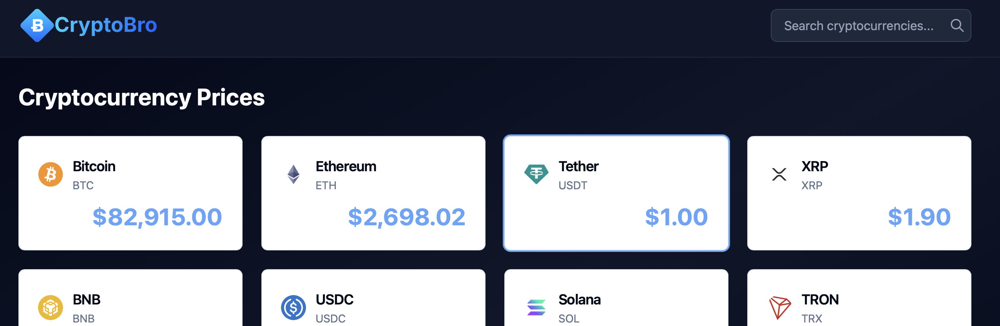

<div align="center">
  <a href="https://github.com/daniel-samson/cryptobro">
    
  </a>
  <p>
    <strong>A web application that displays information about the latest cryptocurrency prices.</strong>
  </p>
</div>



## Project Status

[](https://github.com/daniel-samson/cryptobro/actions/workflows/backend-ci.yml)
[](https://github.com/daniel-samson/cryptobro/actions/workflows/frontend-ci.yml)

## Overview

Cryptobro is a monorepo cryptocurrency price tracking application with multiple frontend implementations:

- **Frontend (Nuxt)**: Nuxt 3 application with Vue 3, Tailwind CSS, and shadcn/vue components
  - 📚 **[Frontend Documentation](front-end/README.md)**

- **Frontend (Angular)**: Angular 21 application with Tailwind CSS and Zard UI components
  - 📚 **[Frontend Documentation](front-end-ng/README.md)**

- **Backend**: Laravel 12 REST API that integrates with the CoinGecko API
  - 📚 **[Backend Documentation](backend/README.md)**
  - 📚 **[API Documentation](backend/API.md)**

## Quick Start

### Prerequisites

- **Backend**: PHP 8.2+, Composer, SQLite
- **Frontend**: Node.js 18+, npm

### Setup in 3 Steps

1. **Clone the repository:**
   ```bash
   git clone https://github.com/daniel-samson/cryptobro.git
   cd cryptobro
   ```

2. **Start the backend:**
   ```bash
   cd backend
   composer install
   cp .env.example .env
   php artisan key:generate
   php artisan migrate
   composer run dev  # Starts on http://localhost:8000
   ```

3. **Start the frontend** (in a new terminal):

   **Option A - Nuxt (Vue 3):**
   ```bash
   cd front-end
   npm install
   cp .env.example .env
   npm run dev  # Starts on http://localhost:3000
   ```

   **Option B - Angular 21:**
   ```bash
   cd front-end-ng
   npm install
   cp .env.example .env
   npm run start  # Starts on http://localhost:4200
   ```

4. **Open your browser:**
   - Frontend (Nuxt): http://localhost:3000
   - Frontend (Angular): http://localhost:4200
   - Backend API: http://localhost:8000/v1/health

## Project Structure

```
cryptobro/
├── front-end/         # Nuxt 3 Vue application
│   ├── components/    # Vue components (including shadcn/vue)
│   ├── pages/         # File-based routing
│   ├── app/           # Composables, utils, layouts
│   └── README.md      # Frontend (Nuxt) documentation
│
├── front-end-ng/      # Angular 21 application
│   ├── src/
│   │   ├── app/       # Angular components and services
│   │   ├── pages/     # Routed page components
│   │   └── shared/    # Shared components and utilities
│   └── README.md      # Frontend (Angular) documentation
│
├── backend/           # Laravel 12 API
│   ├── app/           # Application code
│   ├── routes/        # API routes
│   ├── tests/         # PHPUnit tests
│   ├── README.md      # Backend documentation
│   └── API.md         # API endpoint documentation
│
└── design/            # Design assets and branding
```

## Key Features

- Real-time cryptocurrency price tracking
- Search functionality for 250+ cryptocurrencies
- Detailed coin information with market data
- Responsive design (mobile-first)
- API caching to minimize external API calls
- Comprehensive test coverage (frontend & backend)

## Documentation

- **[Frontend (Nuxt) README](front-end/README.md)** - Nuxt 3 setup, components, testing
- **[Frontend (Angular) README](front-end-ng/README.md)** - Angular 21 setup, components, testing
- **[Backend README](backend/README.md)** - Laravel setup, development, testing
- **[API Documentation](backend/API.md)** - Complete REST API reference
- **[Development Guide](CLAUDE.md)** - Git workflow and development standards

## Technology Stack

### Frontend Options

**Option 1 - Nuxt (Vue 3):**
- [Nuxt 3](https://nuxt.com) - Vue 3 framework
- [Tailwind CSS](https://tailwindcss.com) - Utility-first CSS
- [shadcn/vue](https://www.shadcn-vue.com) - Accessible component system
- [Vitest](https://vitest.dev) - Unit testing

**Option 2 - Angular 21:**
- [Angular 21](https://angular.dev) - Full framework with standalone components
- [Tailwind CSS](https://tailwindcss.com) - Utility-first CSS
- [Zard UI](https://zardui.com) - Component library
- [Vitest](https://vitest.dev) - Unit testing with Testing Library

### Backend
- [Laravel 12](https://laravel.com) - PHP framework
- [SQLite](https://www.sqlite.org) - Database
- [CoinGecko API](https://www.coingecko.com/en/api) - Cryptocurrency data source
- [PHPUnit](https://phpunit.de) - Unit testing

## Development

### Running Tests

**Backend:**
```bash
cd backend
composer run test
```

**Frontend (Nuxt):**
```bash
cd front-end
npm test
```

**Frontend (Angular):**
```bash
cd front-end-ng
npm test
```

### Code Quality

**Backend** (Laravel Pint):
```bash
cd backend
./vendor/bin/pint
```

**Frontend (Nuxt)** (ESLint):
```bash
cd front-end
npm run lint
```

**Frontend (Angular)** (ESLint):
```bash
cd front-end-ng
npm run lint
```

## API Endpoints

| Method | Endpoint               | Description                    |
|--------|------------------------|--------------------------------|
| GET    | `/v1/health`           | Health check                   |
| GET    | `/v1/coins/markets`    | Top 10 cryptocurrencies        |
| GET    | `/v1/coins/search?q=*` | Search cryptocurrencies        |
| GET    | `/v1/coins/{symbol}`   | Get coin details by symbol     |

See [API Documentation](backend/API.md) for detailed endpoint specifications.

## Contributing

Please see [CLAUDE.md](CLAUDE.md) for:
- Git workflow (Gitflow)
- Branch naming conventions
- Commit message format
- Code quality standards

## License

This project is part of the Cryptobro monorepo.

## Powered By

Cryptocurrency data provided by [CoinGecko](https://www.coingecko.com/).
